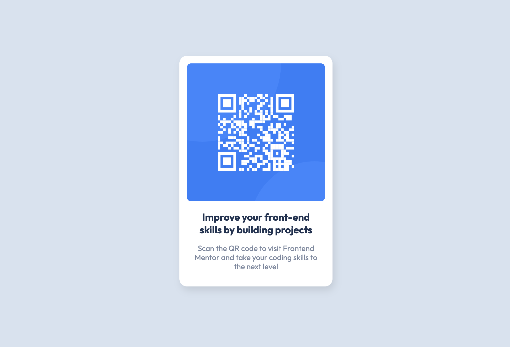

# Frontend Mentor - QR code component solution

This is a solution to the [QR code component challenge on Frontend Mentor](https://www.frontendmentor.io/challenges/qr-code-component-iux_sIO_H). Frontend Mentor challenges help you improve your coding skills by building realistic projects. 

## Table of contents

- [Overview](#overview)
  - [Screenshot](#screenshot)
  - [Links](#links)
- [My process](#my-process)
  - [Built with](#built-with)
  - [What I learned](#what-i-learned)
 
## Overview

### Screenshot

### Links

- Solution URL: [Solution URL](https://github.com/Jack-OC/QR-Code-Component)
- Live Site URL: [Live Site URL](https://jack-oc.github.io/QR-Code-Component/)

## My process

### Built with

- Semantic HTML5 markup
- CSS custom properties
- Flexbox
- Mobile-first workflow

### What I learned
This was another relatively simple design, that I felt was good practice in using HTML and CSS. I did this design Mobile first.
